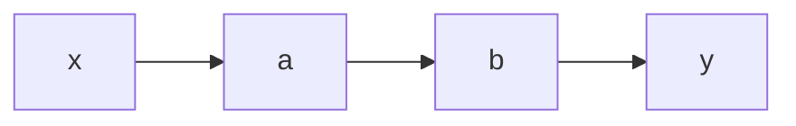
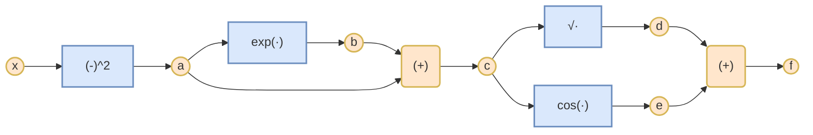

## Gradiente
 ![[Derivadas, derivadas parciales#Derivadas parciales]]
## Gradientes de funciones con Valor-Vector
Ahora generalizaremos el concepto de gradiente para funciones con valor-vector $f:\Re^n \rightarrow \Re^m$ y un vector $x = [x_1,...,x_n]^T \in \Re^n$ y el vector correspondendiente de la función es: $$f(x) = \begin{bmatrix} f_1(x) \\ \vdots \\ f_n(x)\end{bmatrix} \in \Re^m$$

Las reglas de la diferenciación son las mismas de antes, con lo que la derivada parcial de la función valor-vector  $f:\Re^n \rightarrow \Re^m$  con respecto a $x_i \in \Re, i=1,...,n$ se define como:$$\frac{\partial f}{\partial x_i} = \begin{bmatrix} \frac{\partial f_1}{\partial x_1} \\ \vdots \\ \frac{\partial f_m}{\partial x_n}\end{bmatrix}$$
Sabemos que el gradiente de $f$ respecto a un vector es la fila vector de las derivadas parciales. Dicho esto, obtenemos el gradiente de $f: \Re^n \rightarrow \Re^m$ con respecto a $x \in \Re^n$ como:$$\frac{\partial f(x)}{\partial x} =  
\begin{bmatrix} \frac{\partial f(x)}{\partial x_1} && \cdots && \frac{\partial f(x)}{\partial x_n}\end{bmatrix} = 
\begin{bmatrix} \frac{\partial f_1(x)}{\partial x_1} && \cdots && \frac{\partial f_1(x)}{\partial x_n} \\ \vdots && &&  \vdots \\ \frac{\partial f_m}{\partial x_1}  && \cdots && \frac{\partial f_m(x)}{\partial x_n}\end{bmatrix}$$

### Definición: Jacobiana
La colección de todas las derivadas parciales de primer orden de una función valor-vector  $f: \Re^n \rightarrow \Re^m$ se llama Jacobiana($J$). $J$ es una matriz $J \in \Re^{m*n}$ definida tal que: $$\begin{align}
J = \nabla_{\mathbf{x}} f = \frac{df(x)}{dx} = \begin{bmatrix} \frac{\partial f(x)}{\partial x_1} && \cdots && \frac{\partial f(x)}{\partial x_n}\end{bmatrix} = 
\begin{bmatrix} \frac{\partial f_1(x)}{\partial x_1} && \cdots && \frac{\partial f_1(x)}{\partial x_n} \\ \vdots && &&  \vdots \\ \frac{\partial f_m}{\partial x_1}  && \cdots && \frac{\partial f_m(x)}{\partial x_n}\end{bmatrix}
\\
x = \begin{bmatrix} x_1 \\ \vdots \\ x_n\end{bmatrix}, J(i,j) = \frac{df_i}{dx_j}
\end{align}
$$
Una función de primer orden es la que recibe un vector como entrada y devuelve un número (escalar)  $f: \Re^n \rightarrow \Re^1$

Anteriormente hemos estudiado como se podía utilizar el determinante para calcular el área de un paralelogramo. Dados los vectores $$\begin{align} b_1 = [1,0]^T, b_2 = [0,1]^T \tag{1} \\
c_1 = [-2,1]^T, c_2 = [1,1]^T \tag{2}
\end{align}$$
Entonces el área será:$$\begin{align} det(\begin{bmatrix} 1 && 0 \\ 0 &&1\end{bmatrix})  = 1 \tag{1} \\
det(\begin{bmatrix} -2 && 1 \\ 1 &&1\end{bmatrix}) = |-3| = 3 \tag{2}
\end{align}$$

Lo que podemos observar es que el área de la segunda matriz es 3 veces mas grande que el de la primera. Podemos encontrar este factor de escalado encontrando una relación lineal que transforme las variables $\large (b_1,b_2)\rightarrow(c_1,c_2)$

En este caso el mapeo es lineal y el valor absoluto del determinante nos da el factor de escalado que necesitamos. Hay varios métodos de encontrar esta relación:

### 1: Relación lineal
Dados los vectores  $$\begin{align} b_1 = [1,0]^T, b_2 = [0,1]^T \tag{1} \\
c_1 = [-2,1]^T, c_2 = [1,1]^T \tag{2}
\end{align}$$como bases de $\Re^2$, realizaremos un cambio de base, con lo que habrá que encontrar la matriz de transformación.

buscamos $J\in\Re^{2*2}$ de manera que  $$\begin{align} Jb_1 = c_1 ,
Jb_2 = c_2 \\
Jb_1 = c_1 \rightarrow \begin{bmatrix} a_{11} && a_{12} \\ a_{21} && a_{22}\end{bmatrix} \begin{bmatrix} 1  \\ 0 \end{bmatrix} = \begin{bmatrix} -2  \\ 1\end{bmatrix} \large \rightarrow \begin{bmatrix} a_{11} * 1 +  a_{12} * 0 \\ a_{21} * 1 + a_{22} * 0\end{bmatrix} ; a_{11} = -2 ,  a_{21} = 1
\\
Jb_2 = c_2 \rightarrow \begin{bmatrix} a_{11} && a_{12} \\ a_{21} && a_{22}\end{bmatrix} \begin{bmatrix} 0  \\ 1 \end{bmatrix} = \begin{bmatrix} 1  \\ 1\end{bmatrix} \large \rightarrow\begin{bmatrix} a_{11} * 0 +  a_{12} * 1 \\ a_{21} * 0 + a_{22} * 1\end{bmatrix} ; a_{11} = 1 ,  a_{21} = 1
\\
J = \begin{bmatrix} -2  && 1 \\ 1  && 1 \end{bmatrix}
\end{align}$$

Finalmente, el valor absoluto del determinante de la matriz de transformación nos devuelve el factor de escalado $|det(J)| = 3$.

### 2: Derivadas parciales
El método anterior funciona para transformaciones lineales, pero para las no lineales hay que seguir el método de las derivadas parciales

En este caso, dada $f: \Re^2 \rightarrow \Re^2$ realiza una transformación de variables. En el ejemplo anterior $f$ relaciona la representación de coordenadas $x \in \Re^2$ con base ${b_1,b_2} \rightarrow {c_1,c_2}$ . Para encontrar esta relación deberemos calcular como varia $f(x)$ con el cambio de $x$ ($\frac{df}{dx} \in \Re^{2*2}$)

Podemos definir $y$ como: $$\begin{align} y_1 = -2x_1 + x_2 \\ y_2 = x_1 + x_2 \end{align}$$con lo que podemos componer la Jacobiana como: $$ J = \begin{bmatrix} \frac{\partial y_1}{\partial x_1} && \frac{\partial y_1}{\partial x_2} \\ \frac{\partial y_2}{\partial x_1} && \frac{\partial y_2}{\partial x_2} \end{bmatrix} =  \begin{bmatrix} -2 && 1 \\ 1 && 1 \end{bmatrix}$$
En caso de que la transformada sea lineal recoge exacatemente el cambio de base, en caso de no ser lineal, recoge una aproximación lineal de esta. El $|det(A)|$ nos devuelve el factor de escalado

El $det$ de las Jacobianas es extremadamente relevante en el contexto de ML/DL para usar el truco de la reparametrización

#### Ejemplo: Gradiente de una función valor-vector
Dadas $f(x) = Ax, f(x) \in \Re^m, A\in\Re^{m*n}, x\in\Re$, para calcular el gradiente, primero determinamos la dimensión de $\frac{df}{dx}$.Ya que $f:\Re^n \rightarrow \Re^m$ concluimos que  $\frac{df}{dx} \in \Re^{m*n}$. 

Seguidamente, para calcular el gradiente determinamos las derivadas parciales de $f$ respecto a $x_j$$$f_i(x) = \sum^n_{j=1} A_{ij}x_j \rightarrow \frac{\partial f_i}{\partial x_j} = A_{ij}$$
Recojemos las derivadas parciales en la Jacobina y obtenemos:$$\frac{df}{dx} = \begin{bmatrix} 
\frac{\partial f_1}{\partial x_1} && \cdots&& \frac{\partial f_1}{\partial x_n} 
\\ 
\vdots && && \vdots 
\\ 
\frac{\partial f_m}{\partial x_1} && \cdots && \frac{\partial f_m}{\partial x_n}
\end{bmatrix} = 
\begin{bmatrix} 
A_{11} && \cdots&& A_{1n} 
\\ 
\vdots && && \vdots 
\\ 
A_{m1} && \cdots && A_{mn}
\end{bmatrix}
$$

## Gradiente de matrices
Nos encontraremos situaciones en las que tendremos que calcular gradientes de matrices respecto a tensores, resultando en tensores multidimensionales. Por ejemplo, si caclulamos el gradiente de $A\in\Re^{m*n}$ respecto a  $B\in\Re^{p*q}$, el resultado será un tensor de derivadas parciales $J$ definido por $$\large J_{ijkl} = \frac{\partial A_{ij}}{\partial B_{kl}}$$
A veces es mas conveniente "achatar" las matrices para convertirlas en un vector $x \in \Re^{mn}$

#### Ejemplo: Gradiente de vector respecto a matriz
Dadas: $$f = Ax, \quad f \in \mathbb{R}^M, \quad A \in \mathbb{R}^{M \times N}, \quad x \in \mathbb{R}^N $$el gradiente viene definido por:$$\begin{align}
\frac{df}{dA} \in \mathbb{R}^{M \times (M \times N)}
\\ \\
\frac{\partial f}{\partial A} = 
\begin{bmatrix}
\frac{\partial f_1}{\partial A} \\
\vdots \\
\frac{\partial f_M}{\partial A}
\end{bmatrix}, \quad 
\frac{\partial f_i}{\partial A} \in \mathbb{R}^{1 \times (M \times N)}
\end{align}$$
Para calcular la derivada parcial conviene escribir: $$f_i = \sum_{j=1}^N A_{ij}x_j, \quad i = 1, \ldots, M,
\frac{\partial f_i}{\partial A_{iq}} = x_q
$$
Esto acaba resultando en unas derivadas parciales tal que:$$\begin{align}\frac{\partial f_i}{\partial A_{i,:}} = x^\top \in \mathbb{R}^{1 \times 1 \times N} \\ \frac{\partial f_i}{\partial A_{k \neq i,:}} = 0^\top \in \mathbb{R}^{1 \times 1 \times N} \end{align}$$Si acumulamos las derivadas parciales en una Jacobina, acaba definida por la siguiente estructura: $$\begin{align}
\frac{\partial f_i}{\partial A} = 
\begin{bmatrix}
0^\top \\
\vdots \\
0^\top \\
x^\top \\
0^\top \\
\vdots \\
0^\top
\end{bmatrix} \in \mathbb{R}^{1 \times (M \times N)}. \tag{5.92}
\end{align}$$
Es decir, que para cuando el índice coincida con la fila evaluada de $f$, terndremos el vector $x^T$, en caso contrario $O^T$ 

#### Ejemplo: Gradiente de matriz respecto a matriz
Dada la siguiente matriz $R \in \mathbb{R}^{M \times N}$  y $f : \mathbb{R}^{M \times N} \to \mathbb{R}^{N \times N} )$ con  
$f(R) = R^\top R =: K \in \mathbb{R}^{N \times N}$ donde queremos encontrar $\frac{dK}{dR} \in \mathbb{R}^{(N \times N) \times (M \times N)}$ $$\frac{dK_{pq}}{dR} \in \mathbb{R}^{1 \times M \times N}$$
Y cuando calculamos las derivadas parciales, resulta en lo siguiente: $$ 
\frac{\partial K_{pq}}{\partial R_{ij}} = \sum_{m=1}^M \frac{\partial}{\partial R_{ij}} R_{mp}R_{mq} = \partial_{pqij}$$ donde $\partial_{pqij}$ identifica a un tensor:
$$\begin{align}
\partial_{pqij} =
\begin{cases} 
R_{iq} & \text{if } j = p, \, p \neq q \\[4pt]
R_{ip} & \text{if } j = q, \, p \neq q \\[4pt]
2R_{iq} & \text{if } j = p, \, p = q \\[4pt]
0 & \text{en caso contrario}
\end{cases}
\end{align}$$
## Gradiente en una red profunda
Un área donde la regla de la cadena se utiliza extensivamente, donde se calcula el valor de la función y como una composición multinivel de funciones: $$\large y = (f_k ◦ f_{k-1} ◦ \cdots f_1)(x) = f_k(f_{k-1}(\cdots(f_1(x))\cdots))$$
donde $x$ son los inputs (p.j. imágenes) y las observaciones (etiquetas, clases) y. Cada función $f_i, i=1,...,k$ tiene sus propios parámetros.

En redes neuronales multicapa tenemos funciones como $$f_i(x_{i-1})= \sigma(A_{i-1}x{i-1} + b{i-1})$$en la capa $i$. En esta función $x_{i-1}$ es la salida de la capa $i-1$, $\sigma$ es la función de activación (sigmoide, tanh, ReLU). Para entrenar los modelos es necesario el gradiente de la función de pérdida $L$ respecto a los params $A_j$ y $b_j$, así como respecto a los inputs de cada entrada.

Para entradas y observaciones ${x,y}$ y una red definida por: $$\large \begin{align}
f_o = x \\
f_i = \sigma(A_{i-1} \times x{i-1} f_{i-1} + b{i-1}), i=1,...,k
\end{align}$$nos interesaría calcular $A_j$ y $b_j$ para $j=0,...,k$ para que la función de pérdida cuadrada $$\large L(\Theta) = ||y-f_k(\Theta,x) ||^2 $$sea mínima para $\large \Theta = \{A_0,b_0,...,A_{k-1}, b_{k-1}\}$

Para obtener los gradientes respecto a $\Theta$, se ha de calcular la $\partial L$ respecto $\Theta_j = \{A_j, b_j\}$ para cada capa: $$\begin{align} \frac{\partial L}{\partial \Theta_{k-1}} = \frac{\partial L}{\partial f_k} \frac{\partial f_k}{\partial \Theta_{k-1}}
\\
\frac{\partial L}{\partial \Theta_{k-2}} = \frac{\partial L}{\partial f_k} \frac{\partial f_k}{\partial f_{k-1}}\frac{\partial f_{k-1}}{\partial \Theta_{k-2}}
\\
\end{align}$$En este caso podemos reutilizar los cálculos de $\large \frac{\partial L}{\partial \Theta_{i+1}} \rightarrow \frac{\partial L}{\partial \Theta}$ 

## Diferenciación automática
Resulta que la "backpropagation" es un caso de uso de un método general, la diferenciación automática. Esta es una evaluación numérica que utiliza variables intermedias y aplica la regla de la cadena

El gráfico representa un flujo sencillo de una entrada $x$ y salida $y$, pasando por unas variables $\{a,b\}$$$\begin{align} \frac{dy}{dx} = \frac{dy}{db}\frac{db}{da}\frac{da}{dx}
\\\\
\frac{dy}{dx} = \frac{dy}{db}(\frac{db}{da}\frac{da}{dx}) \tag{propagación hacia delante}
\\\\
\frac{dy}{dx} = (\frac{dy}{db}\frac{db}{da})\frac{da}{dx} \tag{propagación hacia detrás}
\end{align} $$
A continuación, nos centraremos en la "backpropagation", ya que en redes neuronales, debido a que $\Re^m \rightarrow \Re^n, m>n$, es mas barato computacionalmente calcular de esta manera la función de pérdida

### Ejemplo:
Dada $$\begin{align} \large f(x) = \sqrt{x^2 + exp(x^2)} + cos(x^2 + exp(x^2))
\\
a = x^2, b = exp(a), c = a+b, d=\sqrt(c),e = cos(x) f = d+e
\end{align}$$

El conjunto de operaciones se puede ver como un grafo computacional. Podemos calcular las derivadas parciales respeto a las variables intermedias siguiendo la regla de la cadena
$$\begin{align}
\frac{\partial a}{\partial x} &= 2x, \frac{\partial b}{\partial a} = \exp(a) \\
\frac{\partial c}{\partial a} &= 1 = \frac{\partial c}{\partial b} ,\frac{\partial d}{\partial c} = \frac{1}{2\sqrt{c}}  \\
\frac{\partial e}{\partial c} &= -\sin(c),\frac{\partial f}{\partial d} = 1 = \frac{\partial f}{\partial e} 
\end{align}$$
Y echando un vistazo al grafo calculamos $\frac{\partial f}{ \partial x}$ $$\begin{align}
\frac{\partial f}{\partial c} &= \frac{\partial f}{\partial d}\frac{\partial d}{\partial c} + \frac{\partial f}{\partial e}\frac{\partial e}{\partial c}  \\
\frac{\partial f}{\partial b} &= \frac{\partial f}{\partial c}\frac{\partial c}{\partial b}\\
\frac{\partial f}{\partial a} &= \frac{\partial f}{\partial b}\frac{\partial b}{\partial a} + \frac{\partial f}{\partial c}\frac{\partial c}{\partial a}  \\
\frac{\partial f}{\partial x} &= \frac{\partial f}{\partial a}\frac{\partial a}{\partial x} 
\end{align}$$
Ahora que hemos expresado las derivadas parciales, solo quedaría sustituir con las expresiones calculadas $$\begin{align}
\frac{\partial f}{\partial c} &= 1 \cdot \frac{1}{2\sqrt{c}} + 1 \cdot (-\sin(c)) \\
\frac{\partial f}{\partial b} &= \frac{\partial f}{\partial c} \cdot 1 \\
\frac{\partial f}{\partial a} &= \frac{\partial f}{\partial b} \exp(a) + \frac{\partial f}{\partial c} \cdot 1 \\
\frac{\partial f}{\partial x} &= \frac{\partial f}{\partial a} \cdot 2x 
\end{align}$$
La diferenciación automática es una generalización del ejemplo anterior. Dadas $x_q, ..., x_d$ como entradas y $x_{d+1},...,x_{D-1}$ como variables intermedias y $x_D$ como salida del grafo, entonces el cálculo del grafo se puede representar como: $$\text{Para } i=d+1,...,D; x_i = g_i(x_{pa}(x_i))$$
donde $g(.)$ son funciones elementarles y $x_{Pa}(x_i)$ son los nodos padre de la variables $x_i$. Entonces sabiendo que $f=x_D$: $$\begin{align} \frac{\partial f}{\partial x_D} = 1 
\\\\
\frac{\partial f}{\partial x_i} = \sum_{x_j:x_i \in Pa(x_j)} \frac{\partial f}{\partial x_j} \frac{\partial x_j}{\partial x_i} = \\
= \sum_{x_j:x_i \in Pa(x_j)} \frac{\partial f}{\partial x_j} \frac{\partial g_j}{\partial x_j}
\end{align}$$donde $Pa(x_j)$ es el conjunto de nodos padre de $x_j$ en el grafo

## Hessianas
Hasta ahora se habían estudiado los gradientes, es decir, las derivadas de primer orden. En algunos casos queremos calcular derivadas de un orden mayor.

Dada $f: \Re^2 \rightarrow \Re$ con variables $\{x,y\}$, usamos la siguiente notación para definir las derivadas parciales de mayor orden:

- $\large \frac{\partial^2 f}{\partial x^2}$: La segunda derivada de $f$ respecto a $x$
- $\large \frac{\partial^n f}{\partial x^n}$: la n-ésima derivada de $f$ respecto a $x$
- $\large \frac{\partial^2 f}{\partial y\partial x} = \frac{\partial}{\partial y}(\frac{\partial f}{\partial x})$: derivada parcial de $f$ obtenida de diferenciar respecto a $x$ y luego a $y$
- $\large \frac{\partial^2 f}{\partial x\partial y} = \frac{\partial}{\partial x}(\frac{\partial f}{\partial y})$: derivada parcial de $f$ obtenida de diferenciar respecto a $y$ y luego a $x$

La Hessiana es el conjunto de derivadas parciales de segundo orden