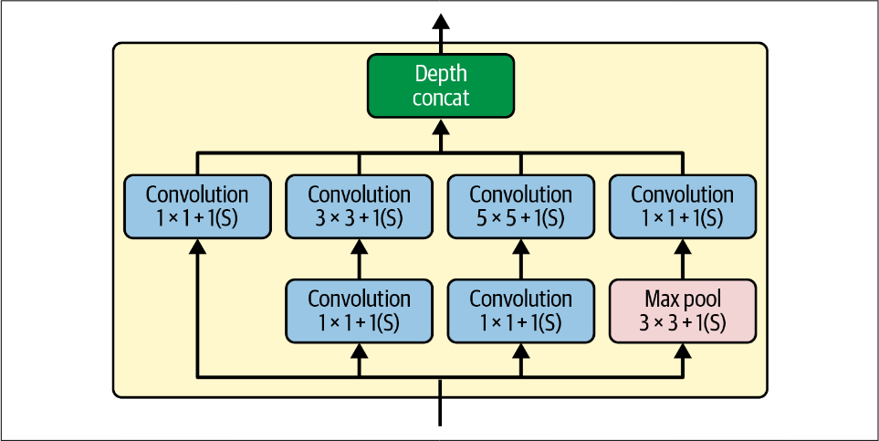
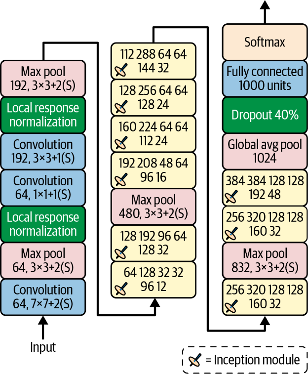
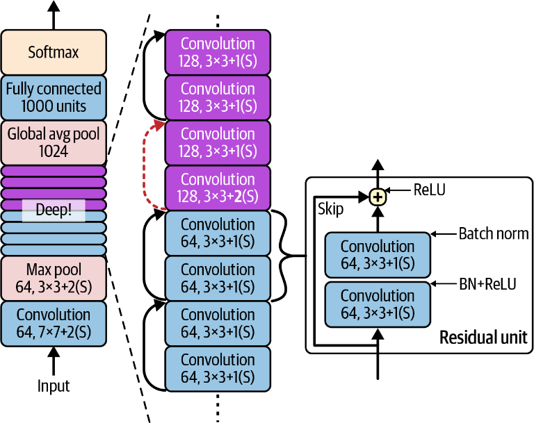
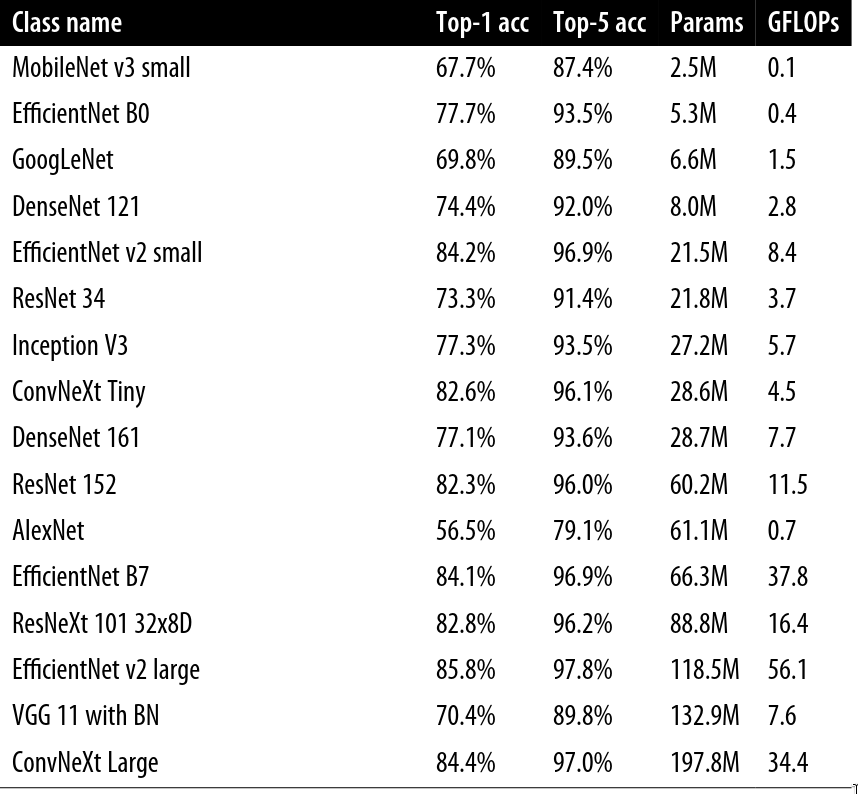

# Deep computer vision using convolutional neural networks

## Capas convolucionales

La parte mas importante de una red convolucional son las capas convolucionales: las neuronas en la primera capa convolucional no se conectana cada pixel en la imagen de entrada, solo a pixeles en sus campos receptivos, a su vez, las neuronas de la siguiente capa se centran en un rectangulo ubicado dentro del campo receptivo de la capa anterior.

Esta arquitectura permite a la neurona concentrarse en las características de "bajo nivel" en las primeras capas intermedias para luego ensamblarlas dentro de características de más "alto nivel" en las siguientes capas. Esta estructura jerárquica es idónea para manejar los objetos compuestos que forman las imágenes del mundo real.

Una neurona en la posicion $(i,j)$ de una capa esta conectada a la salida de las neuronas en la capa anterior ubicadas en $(i \rightarrow i + f_n, j \rightarrow j + f_w)$ donde $f_n$ y $f_w$ son el alto y ancho del campo receptivo. Para que una capa intermedia tenga la misma altura y anchura que la capa anterior se suele utilizar el padding de ceros (añadir ceros alrededor del input).

También es posible conectar una capa de entrada grande a una mucho mas pequeña separando los campos receptivos, reduciendo dramaticamente la complejidad computacional del modelo (El tamaño del paso horizontal/ vertical de un campo receptivo a otro se llama "stride"). Una capa de entrada $5 \times 7$ con padding de ceros puede conectarse a otra capa $3 \times 4$ utilizando campos receptivos de $3 \times 3$ y un "stride" de 2 en ambas direcciones. En general, una neurona en $(i,j)$ de la capa superior es conectada a las salidas de las neuronas de la capa anterior en las filas $i \times s_h \rightarrow i \times s_h+f_h-1$ y las columnas $j \times s_w \rightarrow i \times s_w+f_w-1$ donde $s_h$ y $s_w$ son los "strides" verticales y horizontales

### Filtros

Los pesos de las neuronas se pueden representar como una imagen pequeña del tamaño del campo receptivo. Estos filtros (o kernels) son areas superpuestas a las entradas que escalan los valores. Un ejemplo son los filtros verticales u horizontales, los cuales son, por ejemplo, matrices $7 \times 7$ con todos los valores a 0 menor las columnas o filas centrales, lo cual fuerza a la neurona a únicamente fijarse en esas regiones.

> En el caso de utilizar como entrada una imágen y emplear un filtro vertical, el resultado de la red seria un "mapa de características" en el que la imágen se vería emborronada como si el objeto se hubiese movido verticalmente en el momento de la toma de la imágen. Esto mismo pasaría con el filtro horizontal. Lo que está pasando es que están "resaltando" las líneas verticales/horizontales de la imagen

### Combinar diferentes mapas de características

Las capas convolucionales pueden tener varios filtros, lo cual resulta en un mapa de características por cada uno de los filtros. La salida de estas operaciones se representa de mejor manera en un diagrama 3D.

Hay una neurona por cada pixel de cada mapa de característias y todas las neuronas dentro de un mapa de características comparten los mismos parámetros (kernel, bias, ...), así como las neuronas en mapas de características diferentes utilizan diferentes parámetros. El campo receptivo de una neurona es el mismo, pero se extiende a todos los mapas de características de la capa. En resumen, una capa convolucional aplica simultáneamente filtros entrenables a sus entradas siendo capaz de detectar varias características en cualquier punto de su entrada.

Adicionalmente, las imágenes estan compuestas por subcapas:

- Grayscale: 1 capa de intensidad 0-255
- Color: 3 capas con intensidad 0-255 para formar colores
- Satelite: 3 capas con intensidad 0-255 para formar colores + diferentes frecuencias de la luz

En especifico, una neurona en $(i,j)$ en el mapa de características $k$ en una capa $l$ esta conectada a la salida de las neuronas de la capa anterior $l-1$ en $i \times s_h \rightarrow i \times s_h+f_h-1$ y $j \times s_w \rightarrow i \times s_w+f_w-1$ a lo largo de todos los mapas de características de la capa $l-1$. Es decir, dentro de una misma capa, todas las neuronas en la misma fila $i$ y columna $j$ pero en diferentes mapas de características estan conectados a las salidas de las mismas neuronas de la capa anterior.

Para calcular la salida de una neurona en una capa convolucional se utiliza la siguiente equación:
$$
\large
z_{i,j,k} = b_k + \sum_{u=0}^{f_h-1} \sum_{v=0}^{f_w-1} \sum_{k'=0}^{f_{n'}-1} x_{i',j,k'} \times w_{u,v,k',k} \quad \text{with} \quad \begin{cases} i' = i \times s_h + u \\ j' = j \times s_w + v \end{cases}
$$

donde :
- $\large z_{i,j,k}$ es la salida de la neurona en $(i,j)$ del mapa $k$ de la capa $l$
- $\large s_h$ y $s_w$ son los "strides" verticales y horizontales
- $\large f_h$ y $f_w$ son la altura y anchura del campo receptivo 
- $\large f_{n'}$ es el número de mapas de características de la capa anterior $l-1$
- $\large x_{i',j,k'}$ es la salida de la neurona de la capa anterior $l-1$, en $(i',j')$ del mapa, o canal si es la capa de entrada$ $k'$
- $\large b_k$ es el parametro bias
- $\large w_{u,v,k',k}$ es el peso de conexión entre cualquier neurona en el mapa $k$ de la capa $l$ y su entrada en $(u,v)$ y mapa $k'$

## Capas de agrupacion (Pooling)
La función esencial de las capas pooling es reducir las imagenes de entrada para disminuir la carga computacional, el uso de memoria y el numero de parámetros.

Así como las capas convolucionales, cada neurona en una capa de agrupación esta conectada a las salidas de un número de neuronas de la capa anterior que se encuentran en un campo receptivo. Se ha de definir el tamaño, el "stride" y el tipo de padding como en las capas convolucionales, pero estas capas no tienen ni pesos ni bias, solo agrega mediante una función (como max o media) las entradas.

> Normalmente estas capas de agrupación se aplican independientemente del canal, con lo que la imágen de entrada y la resultante tienen la misma profundiad (número de canales)

Además de las características anteriores, la capa de pooling max tiene cierta cantidad de invarianza a pequeñas traslaciones en la imagen, con lo que introduciendo una capa de estas cada x capas convolucionales podemos obtener invarianza a gran escala, así como una pequeña tolerancia a rotación y escala de la imagen. Esto puede ayudar al modelo a tomar una predicción en la que no dependa de estas variables.

Por otro lado, estas capas son altamente destructivas, reduciendo el tamaño de la imagen, sus detalles, área ... así como contraproducentes en aplicaciones en las que es importante la traslación/rotación/escalado de los objetos en la imagen.

## Arquitecturas de redes neuronales convolucionales (CNNs)

Las arquitecturas típicas de las CNNs suelen apilar varias capas convolucionales, normalmente seguidas de capas ReLU, una capa pooling y vuelta a empezar. La imagen de entrada se vuelve más y más pequeña según avanza en la red pero también se vuelve más profunda, generando más mapas de características, debido a las capas convolucionales. Finalmente, al final de la red convolucional se agrega una red neuronal directa.

### LeNet-5

Es posiblemente la arquitectura mas conocida y esta compuesta de la siguiente manera:

| Layer | Type            | Maps | Size    | Kernel size | Stride | Activation |
|-------|-----------------|------|---------|-------------|--------|------------|
| Out   | Fully connected | –    | 10      | –           | –      | RBF        |
| F6    | Fully connected | –    | 84      | –           | –      | tanh       |
| C5    | Convolution     | 120  | 1 × 1   | 5 × 5       | 1      | tanh       |
| S4    | Avg pooling     | 16   | 5 × 5   | 2 × 2       | 2      | tanh       |
| C3    | Convolution     | 16   | 10 × 10 | 5 × 5       | 1      | tanh       |
| S2    | Avg pooling     | 6    | 14 × 14 | 2 × 2       | 2      | tanh       |
| C1    | Convolution     | 6    | 28 × 28 | 5 × 5       | 1      | tanh       |
| In    | Input           | 1    | 32 × 32 | –           | –      | –          |

### AlexNet

Esta arquitectura de CNN ganó la competición ILSVRC de 2012. Fué la primera en apilar capas convolucionales unas encima de las otras

| Layer | Type            | Maps    | Size    | Kernel size | Stride | Padding | Activation |
|-------|-----------------|---------|---------|-------------|--------|---------|------------|
| Out   | Fully connected | –       | 1,000   | –           | –      | –       | Softmax    |
| F10   | Fully connected | –       | 4,096   | –           | –      | –       | ReLU       |
| F9    | Fully connected | –       | 4,096   | –           | –      | –       | ReLU       |
| S8    | Max pooling     | 256     | 6 × 6   | 3 × 3       | 2      | valid   | –          |
| C7    | Convolution     | 256     | 13 × 13 | 3 × 3       | 1      | same    | ReLU       |
| C6    | Convolution     | 384     | 13 × 13 | 3 × 3       | 1      | same    | ReLU       |
| C5    | Convolution     | 384     | 13 × 13 | 3 × 3       | 1      | same    | ReLU       |
| S4    | Max pooling     | 256     | 13 × 13 | 3 × 3       | 2      | valid   | –          |
| C3    | Convolution     | 256     | 27 × 27 | 5 × 5       | 1      | same    | ReLU       |
| S2    | Max pooling     | 96      | 27 × 27 | 3 × 3       | 2      | valid   | –          |
| C1    | Convolution     | 96      | 55 × 55 | 11 × 11     | 4      | valid   | ReLU       |
| In    | Input           | 3 (RGB) | 227 × 227 | –         | –      | –       | –          |

Para reducir el overfitting se utilizaron dos técnicas de regularización. La primera fue dropout con .5 durante el entrenamiento de F9 y F10 y la segunda fue "data augmentation" moviendo, girando y cambiando la iluminación aleatoriamente de imagenes del conjunto de entrenamiento. 

Por otro lado tambien se utilizó una técnica de regularización llamada "local response normalization" (LRN) en la cual las neuronas que se activan "más fuertemente" iniben otras neuronas en la misma posición en mapas de características vecinos, lo cual fuerza la especialización en diferentes mapas de características y a explorar un rango más grande de características. Esta activación competitiva se ha observado biológicamente.

### GoogLeNet

Ganadora de la edición 2014. Una arquitectura mucho más profunda y que implementaba subredes llamadas "inception modules" que permitían utilizar los parametros de manera más eficiente.

Estas subredes utilizan varias capas convolucionales con diferentes tamaños de kernel (p.j $1 \times 1$ y $3 \times 3$) para captar detalles a diferentes escalas, una capa es capaz de captar patrones finos mientras que la otra tiene un contexto mayor para despues que combine esta información la red con una capa de concatenación en profundidad.

La clave, y lo que permite a esta arquitectura ser lo profunda que es son las capas con kernel $1 \times 1$, ya que actuan como cuello de botella. Estas capas reducen la dimensionalidad antes de aplicar el filtro mas grande.

La arquitectura es la siguiente:

- Las dos primeras capas reducen el tamaño de la imagen por 4, para disminuir el coste computacional, mientras que la primera capa convolucional utiliza un kernel $7 \times 7$ para preservar la mayor cantidad de información posible

- Despues la LRN se ocupa de que las capas anteriores aprendan una gran variedad de características

- Las dos siguientes capas convolucionales sirven de cuelo de botella

- Otra LRN con el mismo objetivo

- Vuelve a reducirse el tamaño de la imagen por dos con una max pool para acelerar los cálculos

- Una pila de 9 modulos inception con un par de max pool para reducir la dimensionalidad y acelerar la red

- La capa de Global Avg pooling devuelve una media de cada mapa de características, dejando a un lado la información espacial

- Las últimas capas son una de dropout 0.4 para regularizar  y una capa de salida con 1000 clases con una función de activación softmax para estimar las probabilidades de las clases

### ResNet

La variante que se llevó la edición de 2015 tenía una profundidad de 152 capas, utilizando "skip conections" (residual units); la entrada de una capa se añadía a la salida de otra capa situada más arriba de la pila

El concepto es que cuando se entrena una red neuronal, el objetivo es hacer que prediga un valor $h(x)$. Si se añade la entrada $x$ a la salida de la red, entonces esta estará obligada a predecir $h(x) - x$, lo que se conoce como aprendizaje residual. Esto es bastante útil ya que acelera el proceso de entrenamiento.

> Cuando se inicializa una red, sus pesos son cercanos a $0$ pero si se añade una "skip connection" la red tiene como salida una copia de su entrada, es decir, la función de salida es parecida a la identidad. Además, con esta técnica la red puede empezar a hacer progreso incluso antes de que sus capas "aprendan" ya que la señal viaja a través de toda la red

Es importante destacar que se reduce el tamaño de la imagen a la mitad con el stride $2$ en la quinta capa convolucional y esto fuerza a saltarse una "skip connection", ya que no podría agregarse la salida y la entrada por diferencia de tamaños. Para solucionar este problema se puede utilizar una capa convolucional con kernel $1 \times 1$ con stride $2$

### Xception

Una variante de GoogLeNet que une ideas de esta arquitectura y de ResNet, reemplazando los "inception modules" por una capa especial llamada "depthwise separable convolutional layer". 

Mientras que las capas convolucionales normales intentan buscar patrones espaciales (como un ovalo) y patrones entre canales (como boca + ojos + nariz = cara), estas capas convolucionales separables asumen que estos dos patrones se pueden modelar de individualmente, estando compuestas por dos componentes:
- La primera parte aplica un solo filtro espacial a cada entrada del mapa de características

- La segunda parte busca exclusivamente patrones entre canales con filtros $1 \times 1$

Ya que este tipo de capas solo tienen un filtro espacial, se recomienda ponerlas detras de capas que tengan una buena cantidad de canales. Debido a esto, esta arquitectura empieza con dos capas convolucionales normales y el resto son convolucionales separables, además de algunas max pool y las capas finales como global avg y una capa de salida densa.

En la práctica, normalmente tienen un mejor desempeño las convolucionales separables que las conovlucionales normales, además de que utilizan menos parámetros, menos memória y hacen menos cálculos que las capas convolucionales normales.

### SENet

Esta arquitectura ganadora de la edición de 2017 amplia arquitecturas ya existentes como ResNet e inception y mejora su desempeño gracias a añadir una pequeña red neuronal, llamada bloque SE, a cada modulo inception o unidad residual en la arquitectura original, analizando la salida de la capa a la que esta adherida, centrándose únicamente en la dimensión de profundidad. Este bloque tiene como objetivo analizar cuales características son más activas juntas, para recalibrar los mapas de características.

> En el caso de reconocimiento de caras, estas redes pueden identificar que normalmente si se ve una boca y una nariz se espera ver unos ojos también, con lo que si el bloque ve una activación fuerte en los mapas de características de la boca y la nariz potenciará el mapa de características de los ojos, o dicho de otra manera, reducirá la relevancia del resto de mapas.

Esta pequeña red esta compuesta únicamente de tres partes:

- Una global avg pool: esta calcula la media de cada mapa de características

- Una capa intermedia con una función ReLU: capa con un número bastante reducido en comparación con los mapas de entrada (unas 16 veces), con lo que los números de los mapas quedan comprimidos en un vector pequeño. Este paso que actua como cuello de botella fuerza al bloque SE a aprender una representación general de las combinaciones de características

- Una capa de salida con una función sigmoide: recoge el vector anterior y saca un vector de recalibarción que contiene un número por mapa de características, entre $(0,1)$, los cuales se utilizan para escalar la relevancia de los mapas.

### Otras arquitecturas

#### MobileNet

Las redes Mobilenet son modelos diseñados para ser ligeros y rápidos, por lo que son populares en aplicaciones móviles y web. Se basam en las capas convolucionales separables, como Xception. De manera similar se implementan modelos como SqueezeNet, ShuffleNet o MNasNet

#### EfficientNet

Esta red es posiblemente la más importante de las que se hablen en esta sección. Los autores propusieron un método para escalar cualquier red convolucional incrementando a la vez la profundidad (nº capas), anchura (filtros por capa) y resolución (tamaño de la entrada) siguiendo unos principios llamados "compound scaling". Los autores utilizaron la busqueda de arquitectura neural para encontrar una buena versión reducida de la arquitectura de ImageNet y luego aplicaron "compound scaling" para crear versiones cada vez más grandes de dicha arquitectura.

El "compound scaling" se fundamenta en una medición logarítmica del presupuesto de computación, definido como $\phi$, de tal manera que si el presupuesto se duplica, $\phi$ aumenta en 1, dando la relación proporcional entre las operaciones disponibles en entrenamiento como $2^{\phi}$. Dicho esto, la profundidad, anchura y resolución de la CNN escalan como $\alpha^{\phi}, \beta^{\phi}, \gamma^{\phi}$ respectivamente.

> Los valores de estos factores tienen que $> 1$ y $\alpha \times \beta^{2} \times \gamma^{2} \approx 2$

En resumen, este escalado no es que sea gratuito; es una forma de escalar razonadamente una red neuronal, pudiendo predecir el impacto en la velocidad de entrenamiento e inferencia pudiendo optimizar dicho impacto y obteniendo más precisión que si se escalase únicamente una de las tres dimensiones.

#### ConvNext

ConvNext es similar a ResNet pero con ciertos cambios inspirados en las mejores versiones de las arquitecturas de transformers de visión, como utilizar kernels grandes, menos funciones de activación y capas de normalización en cada residual unit

### Elegir la arquitectura correcta

Esta decisión recae únicamente en los requerimientos del proyecto, ¿Qué es lo más importante? Precisión, tamaño del modelo, velocidad de inferencia, consumición de energía... PyTorch tiene muchos modelos preentrenados [[Lista de opciones](https://pytorch.org/vision/stable/models)], algunos de estos són los siguientes:

### Requerimientos de RAM GPU: Inferencia vs Entrenamiento

Las CNN necesitan *mucha* RAM. Una única capa convolucional con 200 filtros $5 \times 5$ con stride $1$ y padding="same", procesando una imagen RGB $150 \times 100$:

- Número de parametros 15200 ($5 \times 5 \times 3 + 1 \times 200$). No es mucho teniendo en cuenta que para generar una salida del mismo tamaño, una red neuronal necesitaria $ 200 \times 150 \times 100$ neuronas, cada una conectada a $ 150 \times 100 \times 3$ entradas, un total de $135$ *mil millones* de parametros

- Por otro lado, cada uno de los 200 mapas de características contiene $ 150 \times 100$ neuronas que necesitan calcular una suma de pesos de sus $5 \times 5 \times 3 = 75$ entradas, unas $225$ millones de multiplicaciones

- Con lo que la salida de la red convolucional ocupara unos $200\times150\times100\times32 = 90$ millones de bits (12MB) de RAM por cada instancia, si entrenamos en lotes, digamos 100 instancias, entonces esta única capa convolucional utilizará ella sola $1.2$ GB de RAM

Durante la inferencia solo necesitas en memória tener hasta dos capas convolucionales, ya que una vez que una es calculada, puede ser reemplazada por la siguiente, mientras que en tiempo de entrenamiento es necesario mantener en memória todos los cálculos necesarios en el forward pass para la retro-propagación.

Si se queda sin memória la GPU mientras entrena el modelo, se puede reducir el tamaño del lote utilizando varios trucos para intentar mantener los beneficios de los lotes grandes, como mantener durante varios lotes los cálculos de los gradientes. Tamién se puede intentar reducir la dimensionalidad con "strides", quitar algunas capas, quantizar el modelo (reducir su precisión p.j de 32 bits a 16 bits) o incluso distribuir las capas entre GPU y CPU

## Clasificación y Localización 
La localización de objetos se puede expresar en problemas de regresion lineal; predecir el centro de la bounding box o  incluso su altura y anchura o las coordenadas que la delimiten (esquinas superior izquierda e inferior derecha). En definitiva esto quiere decir que necesitamos una capa adicional con una salida de cuatro numeros.

El modulo de FlowerLocator combina dos cabezas, la del modelo de clasificación y una capa adicional para la salida de las coordenadas. La segunda tiene las mismas entradas que la primera, pero solo saca numeros. Una vez este entrenado se puede utilizar como el resto de modelos, pero para entrenarlo hay que hacerlo como ya se ha visto.  Para este caso en concreto pordia utilizarse cross entropy para la prediccion de clases e intersect over union (IoU) para la de las bounding box.

Para el entrenamiento de la segunda cabeza habria que tener etiquetadas las cajas que contengan a estas flores, ya bien sea a mano o con herramientas que ayuden a acelerar el proceso. Una vez etiquetadas habria que crear un nuevo conjunto de datos, donde cada registro tuviese una imagen, etiqueta y bounding box. TorchVision ya tiene una clase para BoundingBoxes que representa una lista de ellas.

La clase de BoundingBoxes es una subclase de TVTensor que a su vez es una subclase de Tensor, es decir, se puede tratar exactamente como un tensor pero con mas funcionalidades, con lo que se pueden aplicar transformers de la misma manera que a las imagenes

Por otro lado, MSELoss funciona normalmente bien para entrenar el modelo, pero no la metrica adecuada para evaluar la predicción de las cajas. Como se ha comentado antes IoU es la metrica a utilizar. Es el area en la que se solapan las cajas del etiquetado y la predicción dividido entre el area de su union, es decir, si no se solapan nada las cajas 0, en el caso de que haya un encaje perfecto 1 (IoU = |P ∩ T| / |P ∪ T|). El problema de esta métrica en el entrenamiento es que, indiferentemente de la distancia de estas cajas, si no hay solape IoU = 0, con lo que no habra gradiente ni progreso, de ahí que se implementase el GIoU, el cual considera la caja mas pequeña S que contiene P y T (prediccion y etiquetado) y resta de IoU el rato de S que no esta cubierto por P o T (GIoU = IoU – |S – (P ∪ T)| / |S|). Esto resulta en un número mas pequeño cuanto mas se  diferencien P y T, pero como queremos maximizar esta metrica, la perdida sera 1 - GIoU.

Otra variante es la IoU completa (CIoU), la cual considera $3$ factores geometricos:
    - La distancia a los centros de P y T normalizada por la distancia de la diagonal S
    - La similitud entre los ratios de aspecto entre P y T

La metrica es 1 - CIoU y esta implementada en torchvision.

## Detección de objetos

Clasificar y localizar objetos como se ha comentado es una tarea encomiable, pero existe un problema cuando son mas de uno los objetos que hay en la imagen. La solución común era utilizar una red entrenada para detectar y clasificar en el centro de la imagen y se iba desplazando sobre la imagen, haciendo predicciones, no solo sobre la clase y bounding box, si no sobre una puntuación de "objeto"; la probabilidad de que esa imagen contuviese un objeto en ella. 

Esta tecnica era bastante sencilla, pero tenia sus problemas:
    - Objetos de varios tamaños, con lo que la primera pasada podía estar acompañada por otras con matrices más pequeñas/grandes
    - Deteccion multiple del mismo objeto, con sus multiples clases y bounding boxes

Para esto último se utilizaba non-max suppression, que eliminaba las bounding boxes por debajo de un umbral de puntuación de objeto. Seguidamente, de las que quedaban, se quedaba con la que mas puntuación de objeto tenia y eliminaba el resto que se solapasen con ella repetidamente hasta que no quedasen mas cajas que suprimir. 

El funcionamiento era bueno, pero en tiempo de inferencia era desastroso ya que requeria que se predijese multiples veces sobre la misma imagen.

### Redes completamente convolucionales

Afortunadamente hay una manera más rápida de desplazar una red sobre una imagen, utilizar una FCN (fully convolutional network). Esta idea introducida en el paper de 2015 [ https://homl.info/fcn ] para la segmentación semántica apuntaba a que se podia reemplazar las capas "densas" de una red con capas convolucionales. Estas capas tienen que tener un número de filtros igual a la cantidad de neuronas en la capa densa, el tamaño del filtro debe ser igual que el número de mapas de características y el padding debe ser "valid", mientras que el stride puede ser $1$ o más, pero los resultados entre capas serán los mismos.

Esto es importante por qué una capa densa espera un tamaño de entrada específico, ya que tiene un peso por entrada, mientras que la capa convolucional puede procesar imágenes de cualquiera de los tamaños. Ya que una FCN solo contiene capas convolucionales, esta puede entrenarse y utilizarse con imágenes de cualquier tamaño.

### You Only Look Once (YOLO)

YOLO es una arquitectura para la detección de objetos rápida y precisa propuesta en un paper de 2015 [ https://homl.info/yolo ], ques es capaz de correr sobre video en tiempo real. Esta arquitectura es parecida a las FCN pero con unos cambios bastante importantes:

    - Para cada celda matriz YOLO solo considera como objetos aquellos que tienen el centro de su caja en esa celda. Sus coordenadas son relativas a la celda, siendo $(0,0)$ la esquina superior izquierda y $(1,1)$ la esquina inferior derecha, aun que la altura/anchura de esta puede salirse de la celda

    - Tiene dos cajas como salida para ayudar al modelo a manejar situaciones en las que hay objetos muy pegados entre ellos y que el centro de la caja esta en la misma celda.

    - YOLO tambien saca una distribución de las probabilidades de clase para cada celda, prediciendo 20 clases. Esto produce un mapa de probabilidades de clase aproximado. Es importante aclarar que el modelo predice distribuciones de probabilidades por celda, no por caja.

## Seguimiento de objetos

El seguimiento de objetos es un reto, ya que estos se mueven, crecen o encojen e incluso cambian cuando se dan la vuelta o tienen una iluminación diferente o son opacados por otro objeto. Uno de los sistemas mas populares para el seguimiento de objetos es DeepSORT, basado en una combinación de algorítmos clásicos y deep learning:

    - Utiliza filtros Kalman para estimar la posición más probable de un objeto basado en sus detecciones previas y asumiendo un movimiento constante
    
    - Utiliza un modelo para medir lo parecidos que son el objeto y las nuevas detecciones
    
    - Utiliza el algorítmo húngaro para mapear nuevas detecciones a objetos ya existentes, encontrando la combinación de mapeado que minimiza la distancia entre detecciones y posiciones predichas

La libreria de Ultralytics tambien tiene soporte para seguimiento de objetos con su algoritmo Bot-SORT, una versión mejorada de DeepSORT gracias a la compensación del movimiento de camara y modificaciones al filtro Kalman.

## Segmentación semántica

En la segmentación semántica cada pixel se le asigna a una clase del objeto al que pertenece, lo cual hace indistinguibles diferentes objetos de la misma clase. El principal problema de este método es la resolución espacial que se pierde en la imagen cuando pasa por una red convolucional normal, con lo que esta puede saber que hay una persona en una zona general de la imágen, pero no puede llegar a ser más preciso que eso.

Para esto hay varias soluciones, algunas más complejas otras más simples. En las FCN, por ejemplo, acabas teniendo una imágen reducida en comparación a la entrada, con lo que se añade una capa de escalado que multiplica la resolución para devolver la imagen a su tamaño original. Esto puede hacerse de varias maneras, pero en ese paper se eligió la capa convolucional traspuesta (es similar a utilizar una capa convolucional con estrides de fracciones como 1/2). El método anterior era aún muy impreciso con lo que lo complementaron con skip connections.