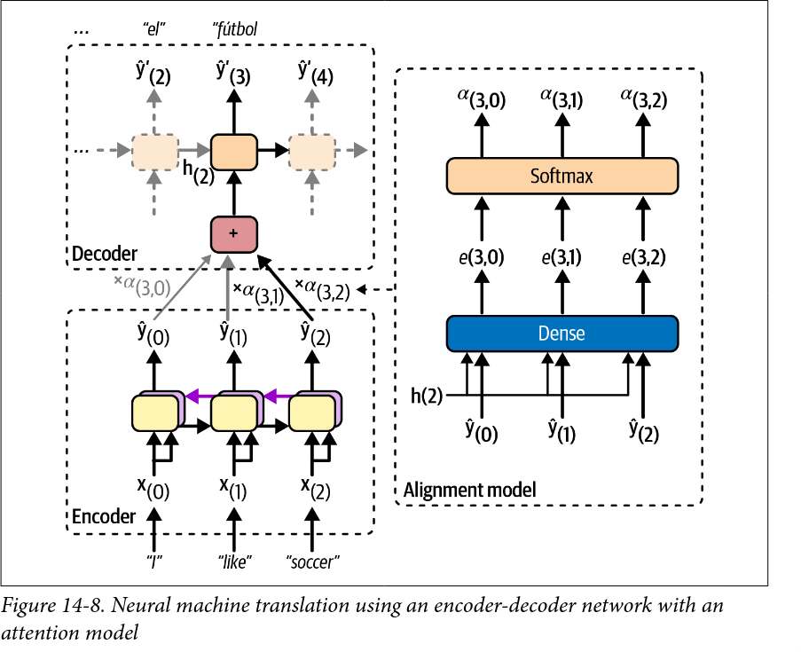

# Natural Language Processing with RNNs and Attention

## Generando textos shakespiresco utilizando una RNN de caracteres

### Creando el conjunto de datos

#### Tokenización a nivel de carácter

Las redes neuronales solo pueden trabajar con números, así que el primer paso para procesar texto es convertirlo en una secuencia numérica. A este proceso se le llama **tokenización**: consiste en trocear el texto en unidades más pequeñas (**tokens**) y asignar a cada token distinto un identificador entero único.

Los tokens pueden ser de distinto tipo según el nivel de granularidad elegido:

- **A nivel de palabra**: cada palabra del vocabulario es un token.
- **A nivel de carácter**: cada carácter distinto que aparece en el texto es un token.
- **A nivel de subpalabra** (como *Byte Pair Encoding*): un punto intermedio muy usado en la práctica.

En este caso se utiliza una **tokenización a nivel de carácter**, la más sencilla de implementar. El **vocabulario** se construye simplemente recopilando todos los caracteres distintos que aparecen en el corpus, de modo que su tamaño depende del alfabeto y los símbolos usados, no del número de palabras distintas.

A partir del vocabulario se construyen dos diccionarios complementarios:

- `char_to_id`: mapea cada carácter a su identificador entero (necesario para **codificar** texto).
- `id_to_char`: mapea cada identificador de vuelta a su carácter (necesario para **decodificar**, es decir, convertir las predicciones del modelo de nuevo en texto legible).

Con estas tablas de equivalencia, codificar un texto consiste en sustituir cada carácter por su ID y empaquetar el resultado en un tensor; decodificar es el proceso inverso.

#### Modelado de lenguaje como predicción de la siguiente ficha

Para entrenar una RNN a generar texto se plantea el problema como una tarea de **modelado de lenguaje autorregresivo**: dado un fragmento de texto, el modelo debe aprender a predecir cuál será el siguiente carácter.

Para ello, el texto codificado (ya convertido en una única secuencia larga de IDs) se recorre con una **ventana deslizante** de longitud fija (`window_length`). Por cada posición de la ventana se generan dos secuencias:

- La **entrada** (`window`): los **n** caracteres a partir de esa posición.
- El **objetivo** (`target`): la misma ventana desplazada una posición hacia adelante.

De esta forma, el objetivo en cada posición de la secuencia es simplemente el carácter que sigue al correspondiente carácter de entrada. Esto permite que, durante el entrenamiento, el modelo aprenda simultáneamente a predecir "el siguiente carácter" para cada una de las posiciones de la ventana, y no solo para la última, aprovechando mucho mejor cada muestra.

#### Limitaciones de representar los tokens como IDs enteros

Aunque ya se dispone de conjuntos de entrenamiento, validación y test numéricos, usar directamente los IDs enteros como entrada de la red sería un error: al ser simplemente índices arbitrarios del vocabulario, su valor numérico no guarda ninguna relación de similitud entre caracteres, y la red podría interpretar erróneamente que existe una relación de orden o magnitud entre tokens que en realidad no tiene ningún significado.

Una alternativa clásica es el **one-hot encoding**, que representa cada token como un vector binario donde todas las posiciones son cero salvo la correspondiente al token, que vale uno. Esto garantiza que todos los tokens quedan igual de "separados" entre sí, sin introducir relaciones de orden falsas. Sin embargo, esta representación escala muy mal con el tamaño del vocabulario: cada vector tiene tantas dimensiones como tokens distintos existan, lo cual resulta manejable para un vocabulario de caracteres, pero se vuelve inviable en cuanto se trabaja con vocabularios de palabras (que pueden tener decenas o cientos de miles de entradas).

La alternativa que ofrecen las redes neuronales, y que se explora en la siguiente sección, son los **embeddings**: representaciones vectoriales densas y de dimensión reducida que la propia red aprende durante el entrenamiento, y que sí son capaces de capturar relaciones semánticas entre tokens.

### Embeddings

El "embedding" o la "incrustación" es una representación densa de información con varias dimensiones, normalmente una característica categórica. Si hay 50000 posibles características, entonces el "one-hot encodign" porduce un vector disperso de 50000 dimensiones, mientras que el embeding produce un vector relativamente pequeño y denso de, por ejemplo, 3000 dimensiones. El tamaño de estas incrustaciones es un parámetro que se puede configurar

Normalmente estos "embeddings" se inicializan de manera aleatoría y se van entrenando a medida que se hace el descenso de gradiente. Ya que estos son entrenables e iran mejorando, esto hará que se vayan acercando unos a otros, ya que representan categorías relativmante parecidas, con lo que cuanto mejor sea la representación de las características, más fácil será para las redes neuronales hacer predicciones más certeras. Esto se conoce como "representation learning".

Y no solo servirán como buenas representaciones de las características para la tarea en la que se esta aplicando si no que normalmente estos podrán reusarse; si vas a implementar una solución será mejor utilizar un embedding preentrenado, como con los modelos, que entrenar uno de cero.

Dependiendo del entrenamiento de las incrustaciones representara de una u otra forma la relación entre las palabras del texto procesado, haciendo que las palabras como los sinonimos o con relaciones semanticas tengan una distancia pequeña entre ellas (como España, Francia e Italia). Pero no todo es la distancia, las incrustaciones de palabras también estan ordenadas en los ejes por importancia; si calculaesmos Rey - Hombre + Mujer el resultado sería Reina o España - Madrid + Francia sería París, con lo que puede llegar a codificar la relación de género o la noción de capital.

Pero no todo es positivo, dependiendo del conjunto de datos, estas incrustaciones pueden capturar los sesgos del autor, ya que si bien puede reconocer que El hombre es a "rey" lo mismo que la mujer es a "reina, de la misma manera "aprenderá" que El hombre es a "doctor" lo que la mujer es a "enfermera".

### Generando texto nuevo al estilo Shakespeare

Una vez entrenado el modelo, generar texto nuevo consiste en aplicar una y otra vez la misma idea de **modelado autorregresivo** que se usó para entrenarlo: se le da un texto inicial, se le pide que prediga el siguiente carácter, ese carácter se añade al final del texto, y el texto ampliado se vuelve a pasar por el modelo para predecir el siguiente, y así sucesivamente.

#### Decodificación voraz frente a muestreo

La forma más directa de elegir "el siguiente carácter" es quedarse siempre con el más probable según el modelo (el `argmax` de las probabilidades de salida). A esto se le llama **decodificación voraz** (*greedy decoding*). El problema es que en la práctica tiende a quedarse atascada repitiendo las mismas palabras o frases una y otra vez, porque en cuanto el modelo entra en un patrón de alta probabilidad, siempre va a elegir continuarlo.

La alternativa es **muestrear** el siguiente carácter en vez de escoger siempre el más probable: si el modelo estima una probabilidad *p* para un token dado, ese token se elige con probabilidad *p*, no con certeza. Esto permite que aparezcan de vez en cuando caracteres que no son los más probables, generando un texto más variado e interesante. En PyTorch, esto se hace con `torch.multinomial()`, que dada una lista de probabilidades por clase, devuelve índices de clase muestreados según esas probabilidades (no necesariamente el de mayor probabilidad).

#### La temperatura como control de la diversidad

Para poder ajustar cuánto se parece este muestreo a la decodificación voraz (siempre lo más probable) o a un muestreo totalmente uniforme (todos los caracteres igual de probables), se introduce la **temperatura**: un número por el que se dividen los logits antes de aplicar la función `softmax` para obtener las probabilidades.

- Una temperatura **cercana a cero** favorece mucho a los caracteres de mayor probabilidad, acercando el comportamiento a la decodificación voraz (y por tanto, a las repeticiones).
- Una temperatura **alta** aplana la distribución de probabilidad, dando a todos los caracteres una probabilidad más parecida entre sí, lo que genera texto más caótico y menos coherente.

Temperaturas bajas suelen preferirse para generar texto que debe ser rígido y preciso (por ejemplo, ecuaciones), mientras que temperaturas moderadas son mejores para generar texto creativo y variado sin perder coherencia. Si la temperatura es demasiado alta, el texto generado deja de parecerse al lenguaje real.

#### Generando el texto carácter a carácter

Esta lógica se puede encapsular en dos funciones que trabajan juntas: una que decide un único carácter nuevo dado el texto actual (aplicando softmax con temperatura sobre los logits del último paso de la secuencia y muestreando con `torch.multinomial`), y otra que llama a la primera repetidamente, añadiendo cada carácter nuevo al texto antes de pedir el siguiente. Esta segunda función es la que implementa directamente la idea de generación autorregresiva: el texto de salida de cada paso es parte de la entrada del paso siguiente.

#### Limitaciones y alternativas más avanzadas

El modelo solo puede aprender a reproducir patrones que quepan dentro de `window_length` (aquí, 50 caracteres): no es capaz de mantener coherencia con algo que apareció mucho antes de esa ventana. Ampliar la ventana ayuda, pero también complica el entrenamiento, y ni siquiera las LSTM o GRU manejan bien secuencias muy largas.

El muestreo con temperatura no es la única técnica de generación. Otras alternativas habituales son:

- **Top-k sampling**: muestrear solo entre los *k* caracteres más probables, descartando el resto.
- **Top-p (nucleus) sampling**: muestrear solo entre el conjunto más pequeño de caracteres cuya probabilidad acumulada supera un umbral dado.
- **Beam search**: en vez de generar un único texto carácter a carácter, mantener varias continuaciones candidatas en paralelo y quedarse con la más probable en conjunto (se retoma más adelante en el capítulo).

También ayuda, simplemente, usar más capas o neuronas en la GRU, entrenar durante más tiempo, o añadir más regularización.

#### Una curiosidad: la neurona del sentimiento

Aunque el char-RNN solo se entrena para predecir el siguiente carácter, esta tarea aparentemente simple obliga al modelo a aprender también estructura de más alto nivel: para acertar el carácter que sigue a "Great movie, I really " ayuda mucho entender que la frase es positiva, y que por tanto es más probable que continúe con "l" (de *loved*) que con "h" (de *hated*).

De hecho, un estudio de OpenAI de 2017 (Radford et al.) entrenó un modelo similar a gran escala y descubrió que una de sus neuronas actuaba, por sí sola, como un clasificador de sentimiento con resultados comparables a los mejores modelos supervisados de la época — sin haber visto ni una sola etiqueta de sentimiento durante el entrenamiento. Este hallazgo fue una de las motivaciones que impulsaron el preentrenamiento no supervisado en NLP, la idea que dio pie a modelos como los que se explorarán más adelante en este mismo capítulo.

## Análisis de sentimientos de texto

### Clasificación de texto: el dataset IMDb

El análisis de sentimientos es una de las aplicaciones más habituales de la clasificación de texto en PLN: dado un fragmento de texto, el modelo debe decidir a qué categoría pertenece (en este caso, si una reseña expresa una opinión positiva o negativa sobre una película). El conjunto de datos de referencia para esta tarea es **IMDb**, formado por reseñas de cine etiquetadas como positivas o negativas; su papel en PLN es equivalente al de MNIST en clasificación de imágenes: un problema sencillo y muy estudiado que sirve de primer banco de pruebas antes de abordar tareas más complejas.

### Tokenización a nivel de subpalabra

La tokenización a nivel de carácter usada para generar texto (ver la sección anterior) no es la única opción, ni siempre la más adecuada. Para tareas de clasificación sobre lenguaje natural con vocabularios grandes es habitual tokenizar a un nivel intermedio entre el carácter y la palabra: la **tokenización a nivel de subpalabra**. La motivación, explorada en un paper de 2016, es resolver el problema de las palabras desconocidas (*out-of-vocabulary*): un modelo que solo conoce palabras completas no sabe qué hacer ante una palabra que no vio en el entrenamiento, mientras que uno capaz de descomponerla en fragmentos más pequeños y conocidos (por ejemplo, "grandísimo" → "grand" + "ísimo") puede seguir infiriendo algo de su significado a partir de esas partes.

#### El algoritmo BPE

El algoritmo más extendido para construir un vocabulario de subpalabras es **Byte Pair Encoding (BPE)**: se parte del conjunto de entrenamiento troceado en caracteres individuales y, en cada iteración, se busca el par de tokens adyacentes más frecuente y se añade como un nuevo token al vocabulario. El proceso se repite hasta alcanzar el tamaño de vocabulario deseado. El resultado es un vocabulario en el que las palabras muy frecuentes acaban representadas por un único token, mientras que las palabras raras se descomponen en varias subpalabras más comunes.

La librería `tokenizers` de Hugging Face implementa este algoritmo (y sus variantes) de forma eficiente, permitiendo montar un tokenizador combinando tres piezas: el **modelo** de tokenización (el algoritmo en sí, p. ej. BPE), un **pre-tokenizador** (que decide cómo trocear el texto antes de aplicar el algoritmo, p. ej. separando por espacios) y un **entrenador**, que recorre el corpus para construir el vocabulario con el tamaño y los tokens especiales indicados, como `<unk>` para las palabras fuera de vocabulario o `<pad>` para el relleno de secuencias.

Una vez entrenado, el tokenizador puede usarse para codificar texto nuevo en tokens e ids, y también decodificar en sentido inverso; el objeto resultante conserva además los *offsets* de cada token (su posición exacta en el texto original), útiles para tareas que necesitan mapear las predicciones de vuelta al texto original.

### Preparando lotes: padding, truncamiento y attention mask

A diferencia del char-RNN, donde todas las ventanas tenían la misma longitud fija por construcción, las reseñas de IMDb tienen longitudes muy distintas entre sí. Para poder agruparlas en un tensor de lote es necesario que todas las secuencias tengan la misma longitud, lo cual se resuelve con dos mecanismos complementarios:

- **Padding**: rellenar las secuencias más cortas con un token especial (`<pad>`) hasta igualar la longitud de la secuencia más larga del lote (o de un máximo fijado).
- **Truncamiento**: cortar las secuencias que superen una longitud máxima.

El problema de rellenar con padding es que esos tokens no aportan información real, y el modelo debe saber ignorarlos. Para ello, junto a cada secuencia codificada el tokenizador genera una **attention mask**: un vector de unos y ceros (uno para los tokens reales, cero para el padding) que permite anular la contribución del padding, por ejemplo multiplicando las representaciones internas del modelo por esta máscara. A partir de esa misma máscara también es trivial obtener la longitud real de cada secuencia, simplemente sumando sus unos.

### Variantes de BPE: BBPE, WordPiece y Unigram LM

El BPE básico tiene un problema con los espacios: si el pre-tokenizador los elimina antes de trocear en caracteres, el tokenizador pierde la pista de dónde iban y puede acabar insertándolos en medio de una palabra al reconstruir el texto. La solución es **BBPE** (*byte-level BPE*), que sustituye los espacios por un carácter especial antes de tokenizar y, sobre todo, opera sobre los **bytes** del texto en lugar de sobre caracteres Unicode. Como cualquier texto —incluidos los emoticonos o símbolos poco comunes— puede descomponerse en un número finito de bytes (256 valores posibles), un vocabulario que contenga todos los bytes nunca necesita recurrir a un token desconocido: cualquier carácter, por raro que sea, siempre puede representarse a nivel de byte.

Existen otras variantes del mismo principio que cambian el criterio para decidir qué par de tokens fusionar, o qué tokens conservar:

| Característica | BBPE | WordPiece | Unigram LM |
|---|---|---|---|
| **Cómo funciona** | Fusiona los pares más frecuentes | Fusiona los pares que maximizan la verosimilitud de los datos | Elimina los tokens menos probables |
| **Ventajas** | Rápido, simple, ideal para multilingüe | Buen equilibrio entre eficiencia y calidad de los tokens | El más significativo, secuencias más cortas |
| **Desventajas** | Puede producir divisiones extrañas | Menos robusto que BBPE para multilingüe | Más lento de entrenar y tokenizar |
| **Usado por** | GPT, Llama, RoBERTa, BLOOM | BERT, DistilBERT, ELECTRA | T5, ALBERT, mBART |

**WordPiece**, introducida por Google en 2016, sigue el mismo esquema iterativo que BPE pero cambia el criterio de fusión: en vez de añadir el par más frecuente, añade el par con mayor puntuación según

$$
score(AB) = \frac{frequency(AB)}{frequency(A) \cdot frequency(B)}
$$

Esta puntuación favorece a los pares que aparecen juntos casi siempre, pero penaliza a los que, aun coincidiendo a menudo, también aparecen por separado en el resto del texto con frecuencia — es decir, prioriza fusiones realmente informativas frente a coincidencias casuales.

**Unigram LM**, por su parte, invierte el proceso: en vez de partir de caracteres sueltos e ir fusionando, arranca con un vocabulario muy grande que incluye prácticamente cualquier palabra, subpalabra y carácter frecuente del corpus, y va eliminando progresivamente los tokens menos útiles hasta alcanzar el tamaño deseado. Parte de la suposición de que el texto se ha generado muestreando tokens del vocabulario de forma independiente unos de otros, lo que le permite estimar qué tokens aportan menos a la verosimilitud del conjunto de entrenamiento y descartarlos.

Estas tres familias de tokenizadores no son alternativas exóticas: son, en la práctica, la capa de preprocesamiento que utilizan la mayoría de los grandes modelos de lenguaje actuales, y la elección de una u otra condiciona directamente el tamaño del vocabulario, la robustez ante distintos idiomas y la calidad de las representaciones que el modelo puede aprender a partir de esos tokens.

### Construyendo y entrenando un modelo de analisis de sentimientos

#### De generar texto a clasificarlo: modelos secuencia-a-vector

El char-RNN de la primera sección era un modelo **secuencia-a-secuencia**: producía una salida (un logit por carácter del vocabulario) en cada paso temporal, porque el objetivo era predecir el siguiente token en cada posición de la ventana. La clasificación de sentimiento es un problema distinto: dada una reseña completa, solo interesa una única predicción al final (positiva o negativa), no una por cada token leído. Esto define un modelo **secuencia-a-vector**: la GRU sigue procesando la reseña token a token igual que antes, pero de todas las salidas intermedias que produce solo se conserva el estado oculto final de la última capa (el resumen de haber leído toda la secuencia), que es el que se pasa a la capa de clasificación. El resto de salidas intermedias se descartan porque no aportan nada a una predicción que solo tiene sentido al terminar de leer la reseña entera.

#### Ignorando el padding desde la propia capa de embedding

La sección anterior ya explicaba cómo el padding y la *attention mask* resuelven el problema de agrupar reseñas de longitud distinta en un mismo lote. La capa de `Embedding` ofrece un mecanismo complementario para lidiar con ese padding: el argumento `padding_idx`. Al indicarle qué id corresponde al token de relleno, la capa fuerza a que ese vector de embedding concreto sea siempre cero y, además, deja de recibir gradiente durante el entrenamiento, de modo que nunca se aleja de cero por mucho que se entrene el modelo. La idea es que, si la entrada de la GRU en las posiciones de padding es un vector nulo, su influencia sobre el estado oculto debería ser mínima.

#### Clasificación binaria: una sola neurona de salida y `BCEWithLogitsLoss`

A diferencia del char-RNN, donde la capa lineal final tenía tantas salidas como caracteres en el vocabulario (para poder aplicar `softmax` y elegir entre muchas clases), aquí el problema es una clasificación **binaria**: solo hay dos clases posibles (reseña positiva o negativa), así que basta con una única neurona de salida. Ese único logit se interpreta como la evidencia a favor de la clase positiva: cuanto más alto (más positivo), más segura está la red de que la reseña es positiva; cuanto más bajo (más negativo), más segura de que es negativa. La función de pérdida adecuada para este planteamiento es `BCEWithLogitsLoss` (*binary cross-entropy with logits*), que aplica internamente una sigmoide al logit para convertirlo en una probabilidad entre 0 y 1 y calcula la entropía cruzada respecto a la etiqueta real, todo en una sola operación numéricamente más estable que encadenar una sigmoide manual con la entropía cruzada por separado.

#### El límite del `padding_idx`: por qué no basta con anular el vector de entrada

El `padding_idx` resuelve el problema solo a medias. Que el embedding de un token de padding sea el vector cero no significa que la GRU lo ignore: la capa recurrente sigue dando un paso por cada posición de la secuencia, padding incluido, actualizando su estado oculto en cada uno de ellos aunque la entrada de ese paso sea nula. Si una reseña es mucho más corta que el máximo del lote, acaba con muchos pasos "vacíos" al final, y el estado oculto final —justo el que se usa para clasificar— puede verse ligeramente distorsionado por esos pasos de más, en vez de ser exactamente el estado que había justo al terminar de leer el último token real.

#### Secuencias empaquetadas: eliminar el padding en vez de camuflarlo

La solución más rigurosa es no dejar que la RNN vea el padding en absoluto, en lugar de intentar minimizar su impacto. Para ello PyTorch ofrece las **secuencias empaquetadas** (`PackedSequence`), una estructura de datos que representa de forma compacta un lote de secuencias de longitudes distintas: en vez de un tensor rectangular con relleno, guarda únicamente los tokens reales de cada secuencia junto con la información necesaria para saber a qué secuencia y qué posición pertenece cada uno. La función `nn.utils.rnn.pack_padded_sequence()` construye esta estructura a partir de un tensor con padding y la lista de longitudes reales de cada secuencia del lote (la misma longitud que ya se obtenía sumando la *attention mask*); `enforce_sorted=False` evita tener que ordenar de antemano el lote de mayor a menor longitud, que es el orden que la función espera por defecto.

Las capas recurrentes de PyTorch (`GRU`, `LSTM`, `RNN`) aceptan un `PackedSequence` exactamente igual que un tensor normal, pero al procesarlo se detienen en cada secuencia justo en su último token real, sin dar pasos adicionales sobre el padding. Esto tiene dos efectos: es más eficiente, porque no se malgasta cómputo en pasos que no aportan información, y sobre todo es más correcto, porque el estado oculto final que se usa para clasificar queda garantizado como el estado justo después del último token real de cada reseña, en vez de una aproximación que depende de cuánto padding haya arrastrado el modelo detrás.

#### Comparando ambos enfoques

Entrenar ambas variantes del modelo —una con padding simple más `padding_idx`, otra con secuencias empaquetadas— partiendo de la misma semilla, los mismos hiperparámetros, el mismo optimizador (`Adam`) y la misma pérdida permite aislar el efecto real del padding sobre el desempeño final, en vez de una diferencia debida al azar de la inicialización o a otros hiperparámetros distintos. La comparación se hace con `BinaryAccuracy`, la métrica de precisión adecuada para un problema de clasificación binaria, evaluada sobre el mismo conjunto de validación para ambos modelos.

### RNNs bidireccionales

En cada uno de los pasos de tiempo, una capa recurrente solo mira a las entradas pasadas y presentes, antes de generar la salida; no es capaz de ver el futuro. Esta RNN tiene sentido cuando estamos haciendo prediccion en unas series temporales o en el decoder de un modelo seq2seq, pero para tareas como la clasificacion de texto o en el encoder de un modelo seq2seq normalmente es preferible mirar al texto que viene despues antes de codificar una palabra.

Una posible solucion es utilizar dos capas recurrentes sobre las mismas entradas, una leyendo las palabras de izquierda a derecha y otra al reves y combinar sus salidas en cada paso de tiempo, normalmente concatenandolas. Esto es precisamente lo que hacen las RNNs bidireccionales.

### Reutilizando embeddings y modelos preentrenados

Nuestros modelos han sido capaces de entrenar embedings utiles para miles de tokens, basados en el texto de las reseñas, aun que impresionante, si tuviese mucho mas texto podria reflejar de una mejor manera el texto incrustado. Por eso es bastante mas util utilizar embeddings preentrenados, aun que estos no hayan utilizado texto de la tarea que se intenta resolver. 

Los embeddings preentrenados llevan siendo populares mucho tiempo, aun que este acercamiento a la solucion tiene sus limites, en particular la representación de una sola palabra en diferentes contextos. La palabra "right" se codifica de manera exactamente igual en "left and right" y en "right and wrong", aun que tengan significados diferentes. Por esto, en un paper de 2018 [ https://homl.info/elmo ] se intenta dar una solución; Embeddings from Language Models (ELMo), los cuales son incrustaciones de palabras contextualizadas, aprendidas de los stados internos de RNNs profundas bidireccionales. En este caso, en vez de utilizar incrustaciones preentrenadas en el modelo, se reusan varias capas de un modelo del lenguaje preentrenado.

Mas o menos a la vez se presenta ULMFiT [ https://homl.info/ulmfit ] demostrando la efectividad del preentrenamiento sin supervision para tareas de PNL. Se entreno un modelo del lenguaje LSTM sobre un texto enorme utilizando aprendizaje auto supervisado y luego se hizo finetunning en varias tareas. Los autores demostraron que el ajustar un modelo preentrenado sobre solo 100 ejemplos etiquetados podia alcanzar el desempeño de uno entrenado sobre 10000 ejemplos.

### Trainer API

Hasta ahora, cada variante del modelo de sentimiento se ha entrenado con un bucle manual (`entrenar_nn`): tokenizar en el `collate_fn`, mover tensores al dispositivo, calcular la pérdida, hacer `backward()` y `step()`, evaluar en validación y decidir cuándo guardar el mejor modelo. La librería `transformers` ofrece una alternativa de más alto nivel para este mismo trabajo: la **`Trainer` API**, que encapsula ese bucle completo (incluyendo checkpoints, *early stopping*, entrenamiento distribuido en varias GPUs, registro de métricas y manejo de padding) detrás de una interfaz declarativa, a costa de perder parte del control fino que sí se tiene escribiendo el bucle a mano.

A diferencia del `collate_fn` usado hasta ahora, que tokenizaba las reseñas sobre la marcha en cada lote, la `Trainer` API espera trabajar con un `Dataset` ya tokenizado de antemano. Esto se consigue con el método `map()` de la librería `datasets`, que aplica una función de preprocesado a todo el conjunto; pasarle `batched=True` hace que esa función reciba lotes enteros de reseñas en vez de una a una, lo cual es mucho más rápido porque el tokenizador puede procesarlas en paralelo internamente.

El modelo también cambia de forma: en vez de construir a mano una GRU sobre los embeddings o los estados de BERT, se usa `BertForSequenceClassification.from_pretrained(...)`, una clase de `transformers` que ya incluye una cabeza de clasificación (una capa lineal) encima del BERT preentrenado, lista para afinarse (*fine-tuning*) sobre la tarea concreta indicando `num_labels`. Cargarlo con `dtype=torch.float16` almacena sus pesos en **precisión de 16 bits** en vez de los 32 bits habituales, reduciendo a la mitad la memoria que ocupa el modelo y acelerando el cómputo en GPUs que soportan esta precisión, a cambio de una pérdida de precisión numérica normalmente asumible.

El resto de piezas de la API tienen un equivalente directo en lo ya visto en la práctica:

- **`TrainingArguments`** centraliza los hiperparámetros de entrenamiento (número de épocas, tamaño de lote, cada cuánto evaluar/guardar/registrar). `load_best_model_at_end=True` junto con `metric_for_best_model="accuracy"` es el equivalente automático de la lógica de "guardar el mejor `state_dict` según la métrica de validación" que `entrenar_nn` implementaba a mano.
- **`compute_accuracy`**, la función que se le pasa a `Trainer` para evaluar, cumple el mismo papel que la métrica de `torchmetrics` (`BinaryAccuracy`) usada en el resto de la práctica.
- **`DataCollatorWithPadding`** sustituye al `collate_fn` manual: se encarga de aplicar padding dinámico a cada lote (rellenando solo hasta la reseña más larga de ese lote concreto, no de todo el dataset), la misma idea que resolvían a mano el tokenizador y `padding_idx`/las secuencias empaquetadas en las clases `SentimentAnalysisModel*`.

Con todas estas piezas montadas en un objeto `Trainer`, todo el bucle de entrenamiento (y la evaluación periódica en validación) queda reducido a una única llamada: `trainer.train()`.

### Pipelines de Hugging Face

Si `Trainer` automatiza el *entrenamiento*, la función **`pipeline()`** automatiza el extremo opuesto: usar un modelo ya entrenado y afinado por otros, sin entrenar ni afinar nada en absoluto. Es el punto final de la progresión de esta práctica, que ha ido subiendo el nivel de reutilización paso a paso — modelo entrenado desde cero, luego solo los embeddings de BERT reutilizados, después una GRU afinada sobre BERT congelado, luego BERT completo afinado con `Trainer` — hasta llegar aquí, donde ni siquiera hace falta un paso de entrenamiento propio.

`pipeline("sentiment-analysis", model=...)` empaqueta en un único objeto el modelo, su tokenizador y todo el pre/postprocesado necesario para una tarea concreta; si no se especifica el argumento `model`, usaría el modelo por defecto asociado a esa tarea. Aquí se elige explícitamente `distilbert-base-uncased-finetuned-sst-2-english`: una versión reducida de BERT (**DistilBERT**) preentrenada sobre la Wikipedia en inglés y un corpus de libros, y afinada sobre SST-2 (Stanford Sentiment Treebank), una tarea de clasificación de sentimiento distinta de IMDb. Pese a no haber visto una sola reseña de IMDb durante su afinado, este modelo alcanza un 88.2% de precisión sobre el conjunto de validación de IMDb, una muestra de hasta qué punto puede generalizar un modelo de lenguaje bien preentrenado y afinado sobre una tarea relacionada.

El pipeline gestiona automáticamente varios detalles que en el resto de la práctica había que resolver a mano: usa la GPU si hay una disponible (con varias GPUs, se elige cuál usar mediante el argumento `device`), y los modelos de `transformers` se cargan siempre en modo evaluación por defecto, sin necesidad de llamar a `.eval()` como se hacía con los modelos propios. El resultado de aplicar el pipeline a un lote de reseñas es una lista con una etiqueta (`"POSITIVE"` o `"NEGATIVE"`) y un `score` por cada una: la probabilidad que el modelo asigna a *esa* etiqueta concreta, no a la clase positiva. Al tratarse de un problema binario, ese `score` nunca puede ser inferior a 0.5, porque si lo fuera el modelo habría elegido directamente la otra etiqueta.

## Red encoder-decoder para traducción

En resumidas cuentas, la arquitectura de un encoder-decoder para esta tarea recibe una secuencia que representa una frase en el idioma original y genera un resultado otra secuencia con la frase traducida al idioma objetivo, formando un modelo seq2seq. El decoder en la fase de entrenamiento recibe como entrada la salida que debería haber tenido, retrasada un paso temporal, sin importar que es lo que ha generado como resultado. A esto se le conoce como "teacher forcing", es una tecnica que acelera el entrenamiento y mejora el desempeño del modelo.El decoder recibe como primer token un SoS o BoS (start/beggining of sequence) "<s>" y se espera que acabe el texto con un EoS (end of sequence) "</s>"

Cada token se representa en un inicio por un ID que recoge la capa de incrustacion para devolver el token embedding y utilizar esto como entrada del encoder y del decoder.

A cada paso, la capa densa de salida del decoder devuelve una puntuación logit para cada token del vocabulario de salida (idioma objetivo) y si pasas estos logits por una capa softmax obtienes la probabilidad estimada para cada token que haya.

Es importante resaltar que en el momento de la inferencia ya no habra que darle como entrada el texto etiqueta al decoder si no que habra que darle la palabra que acaba de generar en el paso anteriro, haciendo un embedding lookup.

### El conjunto de datos y un tokenizador compartido

Para entrenar un traductor hace falta un **corpus paralelo**: pares de frases en las que cada frase en inglés viene acompañada de su traducción al español. Aquí se usa el subconjunto inglés-español de **Tatoeba**, una colección de frases cortas y cotidianas traducidas por voluntarios. Como el dataset solo trae un conjunto de validación y otro de test ya definidos, el de validación original se divide 80/20 para sacar de él los conjuntos de entrenamiento y validación propios, con una semilla fija para que la partición sea reproducible.

En lugar de entrenar un tokenizador para cada idioma, se entrena **un único tokenizador BPE sobre ambos idiomas a la vez**, alimentándolo con las frases fuente y objetivo de cada par (el algoritmo es el mismo que se explicó en la sección de tokenización a nivel de subpalabra). Esto es viable porque el inglés y el español comparten alfabeto y muchísimas subpalabras: raíces de origen latino (*nation*/*nación*), nombres propios, números o signos de puntuación. El resultado es un **vocabulario compartido** de 10 000 tokens, lo que simplifica el modelo: una única tabla de embeddings sirve tanto para la entrada del encoder como para la del decoder, y la capa de salida elige entre ese mismo vocabulario. A los tokens especiales ya conocidos (`<pad>` y `<unk>`) se añaden `<s>` y `</s>`, que marcan el inicio y el final de la frase traducida.

### Preparando los pares: el desplazamiento del teacher forcing

El teacher forcing que se describía más arriba se materializa en cómo se construye cada lote. La frase española se envuelve en `<s> ... </s>` y se tokeniza; a partir de esa secuencia se obtienen dos versiones desplazadas un token entre sí:

- **Entrada del decoder**: la secuencia sin su último token, es decir, empezando por `<s>`.
- **Etiquetas**: la secuencia sin su primer token, es decir, terminando en `</s>`.

Así, en cada posición *t* el decoder recibe el token correcto *t* y debe predecir el token *t+1*: al ver `<s>` debe predecir la primera palabra, al ver la primera debe predecir la segunda, y así hasta predecir `</s>` al ver la última. Es exactamente el mismo esquema de "predecir el siguiente token" del char-RNN de Shakespeare, con la diferencia de que ahora la predicción está **condicionada** por la frase de origen.

Cada lote agrupa cuatro tensores (IDs y *attention mask* de la frase fuente, IDs y máscara de la frase objetivo) que se guardan juntos en una tupla con nombre con su propio método `.to(device)`, para poder mover al dispositivo toda la entrada del modelo de una vez, igual que se haría con un único tensor. El padding se aplica por lote, hasta la frase más larga de cada uno.

### La arquitectura del modelo

El modelo tiene cuatro piezas:

1. **Una capa de embedding compartida**, con `padding_idx` para que el token de relleno no aprenda nada (ver la sección de análisis de sentimientos).
2. **El encoder**, una GRU de dos capas que lee la frase en inglés. Recibe la frase como **secuencia empaquetada**, de modo que se detiene justo en el último token real de cada frase. De su salida solo interesan los **estados ocultos finales de todas las capas**, que forman el resumen de la frase completa: es la misma idea que el modelo secuencia-a-vector de sentimiento, pero conservando el estado de cada capa y no solo el de la última.
3. **El decoder**, otra GRU con el mismo número de capas y el mismo tamaño de estado oculto. Esa coincidencia es obligatoria, porque el decoder no arranca con un estado inicial a cero como hasta ahora, sino con el estado final del encoder, capa a capa. Es el único canal por el que la información de la frase en inglés llega al decoder, así que ese estado hace de **vector de contexto**.
4. **Una capa lineal de salida** que transforma el estado del decoder en cada paso en un logit por cada token del vocabulario. Como en el char-RNN, la salida se permuta para dejar la dimensión de clases en segunda posición, que es donde la esperan `CrossEntropyLoss` y las métricas de `torchmetrics`.

Esta arquitectura tiene un **cuello de botella** evidente: toda la frase de origen, sea de tres palabras o de treinta, se comprime en un vector de tamaño fijo, y el decoder no tiene forma de volver a consultar una palabra concreta del original mientras traduce. En frases cortas funciona razonablemente, pero la calidad cae a medida que la frase se alarga, porque el vector de contexto no da abasto para retener todos los detalles.

### Entrenamiento: la pérdida y por qué la exactitud se queda corta

Traducir es, token a token, un problema de **clasificación multiclase** sobre el vocabulario, así que la pérdida es `CrossEntropyLoss`. Se configura con `ignore_index=0` (el ID de `<pad>`) para que las posiciones de relleno de las etiquetas no contribuyan a la pérdida: sin esto, el modelo "aprendería" a predecir padding y la pérdida quedaría falseada por la proporción de relleno de cada lote.

La métrica más inmediata es la **exactitud por token** (`Accuracy` multiclase, también con `ignore_index=0`), pero mide mal la calidad de una traducción, por tres motivos:

- Se calcula con **teacher forcing**: el modelo siempre ve los tokens correctos anteriores. En inferencia se alimenta de sus propias predicciones, y un error temprano arrastra a los siguientes (a este desajuste entre entrenamiento e inferencia se le llama **exposure bias**).
- Exige el **token exacto en la posición exacta**, cuando una frase admite muchas traducciones válidas: "me encanta el fútbol" cuenta como fallo si la referencia es "me gusta el fútbol".
- Cuenta **subtokens BPE**, no palabras.

Por eso en traducción automática se usa **BLEU** (*Bilingual Evaluation Understudy*), que se calcula sobre traducciones **generadas de verdad**, de forma autorregresiva. BLEU mide qué proporción de los n-gramas de la traducción generada (de 1 a 4 tokens) aparecen en la traducción de referencia, combina esas cuatro precisiones con una media geométrica y aplica una **penalización por brevedad**, para que no salga rentable generar frases muy cortas con pocas palabras pero todas acertadas. El resultado va de 0 a 1 (en los artículos suele darse multiplicado por 100). Como orientación: por debajo de 0.1 la traducción es casi inútil, entre 0.2 y 0.3 se entiende la idea con errores importantes, y a partir de 0.4 se considera de alta calidad. Ni siquiera un traductor humano suele pasar de 0.6, porque solo hay una referencia contra la que comparar.

Para usar BLEU como criterio de validación y de parada temprana, el bucle de entrenamiento sigue entrenando con teacher forcing y pérdida, pero al final de cada época genera las traducciones del conjunto de validación con **decodificación voraz**: en cada paso se elige el token más probable y se le devuelve al decoder como entrada del paso siguiente, hasta que genera `</s>`. Validar así es bastante más lento que calcular la exactitud, porque hay que generar la traducción token a token en vez de hacer una única pasada hacia delante. Un matiz de esta implementación es que tanto las traducciones generadas como las de referencia se reconstruyen desde sus IDs con el mismo tokenizador. Como el pre-tokenizador `Whitespace` no guarda los espacios originales, el texto resultante queda troceado en subtokens y signos de puntuación sueltos. La comparación entre épocas es coherente, pero la cifra sale algo inflada respecto al BLEU que se publica, que se calcula sobre el texto original.

## Busqueda Beam

Para obtener la traducción de una frase entera llamamos al modelo varias veces, generando una palabra cada vez. Esto significa que si el modelo llega a equivocarse en algun punto, arrastrará ese error el resto de la traducción. Por ejemplo: Si queremos traducir "I love football" el modelo puede empezar generando "Me" y puede que la siguiente palabra sea "gustan", lo cual en muchos contextos es una buena manera de traducir "I love", pero este error se arrastra para la tercera palabra la cual podría ser "el", pero como no concuerda el singular con "gustan" el modelo se ve forzado a generar "los" y remata la frase con "futbolistas", con lo que el resultado de traducir "I love footbal" es "Me gustan los futbolistas".

Una de las soluciones más comunes para evitar que un error en algún punto de la traducción conlleve una traducción erronea es utilizar "beam search". Con este método se tiene en cuenta una lista pequeña de las k propuestas más prometedoras y en cada punto de tiempo el decoder intenta extender cad una en una palabra, guardandose solo las k mas prometedoras. Este parametro k es la anchura del haz.

Cuando se generan palabras y se buscan las más prometedoras para continuar o acabar la oración se hace un calculo en el que se multiplica la probabilidad condicional estimada de cada palabra por la probabilidad estimada de la frase que completa. Este proceso se repite, haciendo que el modelo prediga la siguiente palabra en cada una de las k posibilidades eliminando las que no cumplen el corte.

Finalmente, aun que esto mejora la generación de texto, solo sirve para aumentar la precisión de traducción sobre oraciones cortas. Si se extiende demasiado en longitud la secuencia, dada la poca memoria a corto plazo de la que sufren las RNNs, no conseguirá traducir bien la frase por completo. Para esto, se desarrollaron los mecanismos de atención.

## Mecanismos de atención

En un paper de 2014 [ https://homl.info/attention ] se introdujo una técnica que permitia al decoder concentrarse en las palabras apropiadas (como estaban codificadas por el encoder) en cada paso de tiempo. Por ejemplo, en el punto temporal donde el decoder necesita generar la palabra "futbol", concentrará su atención en la palabra "football". Esto significa que el camino de una palabra entrante a su traducción era mucho más corta, con lo que la limitación de memória a corto plazo impactaba mucho menos. Esta idea permitió un avanze significativo en todas las ramas en las que se aplicaba deep learning.

A la izquierda en este diagrama podemos ver el encoder-decoder. Se puede ver que en vez de enviar unicamente el estado oculto final del encoder asi como la palabra etiquetada anterior en cada momento temporal, ahora se envia todas las salidas del encoder. Como el decoder no es capaz de lidiar con todas las salidas a la vez, se hace una suma; en cada paso temporal las células de memória calculan una suma ponderada de todas las salidas, determinando así que palabras prestar su atención el decoder. El peso $\alpha_{(t,i)}$ es el peso de la salida $i$ del encoder en el paso del tiempo $t$ (Por ejemplo, si el peso $\alpha_{(3,2)}$ es mayor a $\alpha_{(3,0)}$ y $\alpha_{(3,1)}$ el decoder concentrará su atencion en la tercera palabra de la frase, "football" en este caso). Dicho esto, el resto del decoder funcionará como antes, en cada paso temporal recibe las entradas, el estado oculto de pasos temporales anteriores y la palabra etiquetada del paso anterior o la salida del paso anterior, dependiendo si esta entrenando o infiriendo.

Por otro lado, a la derecha podemos ver una red neuronal llamada modelo de alineamiento o capa de atención. Esta red se ocupará de generar los valores de los pesos durante el entrenamiento. Todo empieza con una capa densa que recoge como entrada cada una de las salidas del encoder, su último estado oculto y genera una puntuación para cada encoder $e_{(3,2)}$, el cual medirá como de bien está alineada la salida del encoder con los estados ocultos previos del decoder. Finalmente todas las puntuaciones pasan por una capa softmax para obtener el peso final para cada salida del encoder.

Por otro lado, en un paper de 2015 [ https://homl.info/luongattention ] se presento Luong attention o atención multiplicativa, dado que el objetivo del modelo de alineación es medir las similitudes entre las salidas del encoder y los estados ocultos previos del decoder, se propuso calcular el producto elemento por elemento de los dos vectores. Para que esto sea posible los vectores tenian que tener la misma dimensionalidad. El resultado devuelve una puntuación, la cual pasa por una capa softmax que devuelve los pesos finales. También se propuso utilizar el estado oculto del decoder en el paso temporal actual para calcular el vector de atención, el cual es concatenado con el estado oculto del decoder para formar un estado oculto de atención y utilizarlo para predecir el siguiente token. Esto simplifica y acelera el proceso permitiendo que el encoder y el decoder operen independientemente antes de que se aplique la atención.